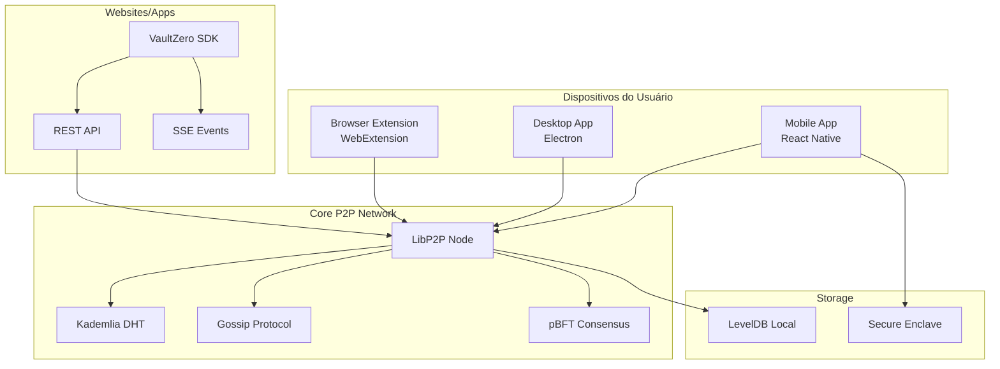
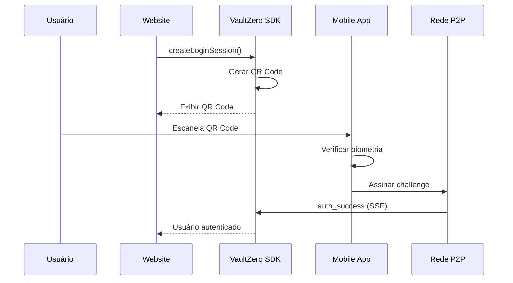
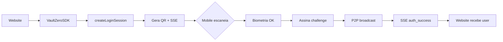

# 📐 VaultZero - Arquitetura Técnica

## Visão Geral

VaultZero utiliza uma arquitetura **P2P descentralizada** baseada em libp2p com:

- **DHT (Kademlia)** para descoberta e armazenamento distribuído
- **Gossip Protocol** para propagação de eventos
- **Consensus (pBFT)** para validação de identidades
- **WebAuthn** para autenticação biométrica

---

## Diagrama de Componentes



---

## Fluxo de Autenticação



---

## Módulos do Core

### 1. Network Layer (`core/src/network/`)

```typescript
// LibP2PNetwork - Gerenciador principal da rede
class LibP2PNetwork {
  start(): Promise<void>           // Inicializa nó libp2p
  stop(): Promise<void>            // Para o nó
  connectToPeer(addr): Promise<boolean>
  broadcast(message): Promise<boolean>
  storeIdentity(identity): Promise<boolean>
  getIdentity(id): Promise<Identity>
}
```

| Arquivo | Responsabilidade |
|---------|------------------|
| `libp2p.ts` | Core P2P, conexões, protocolos |
| `dht.ts` | Distributed Hash Table (Kademlia) |
| `gossip.ts` | Propagação epidêmica de mensagens |
| `sync.ts` | Sincronização de identidades |

### 2. Blockchain Layer (`core/src/blockchain/`)

```typescript
// ConsensusManager - Consenso Bizantino
class ConsensusManager {
  proposeIdentity(identity, proposerId): string
  vote(proposalId, voterId, approve): boolean
  checkConsensus(proposalId): void
}
```

| Arquivo | Responsabilidade |
|---------|------------------|
| `consensus.ts` | pBFT voting e proposals |
| `identity.ts` | Criação e verificação de identidades |
| `ledger.ts` | Armazenamento local de transações |

### 3. Auth Layer (`core/src/auth/`)

```typescript
// AuthenticationManager - Autenticação
class AuthenticationManager {
  registerWithPasskey(userId, userName): Promise<Options>
  authenticateWithBiometric(userId, type): Promise<Challenge>
  completePasskeyAuthentication(response): Promise<User>
}
```

---

## Módulos do Mobile

### P2P Service (`mobile/src/services/p2p.ts`)

Implementação **pura DHT/Gossip** sem HTTP para sincronização:

```typescript
class P2PService {
  // Kademlia DHT
  initializeKademliaDHT(): Promise<void>
  dhtStore(key, value): Promise<boolean>
  dhtGet(key): Promise<any>
  iterativeLookup(key, operation): Promise<any>
  
  // Gossip Protocol
  gossipBroadcast(message): Promise<void>
  performAntiEntropy(): Promise<void>
}
```

### Identity Service (`mobile/src/services/identity.ts`)

```typescript
class IdentityService {
  createIdentity(name, deviceName): Promise<BlockchainIdentity>
  restoreIdentity(mnemonic, name, deviceName): Promise<BlockchainIdentity>
  authenticateWithBiometric(): Promise<boolean>
  authorizeWebsite(siteUrl, fields): Promise<AuthResult>
}
```

---

## Modelo de Dados

### BlockchainIdentity

```typescript
interface BlockchainIdentity {
  address: string              // "0x742d35Cc..."
  publicKey: string            // Ed25519 public key
  mnemonic?: string            // BIP39 12 words (encrypted)
  derivationPath: string       // "m/44'/60'/0'/0/0"
  
  devices: {
    [deviceId: string]: {
      name: string
      addedAt: Date
      lastSync: Date
      publicKey: string
    }
  }
  
  profile: {
    name?: string
    email?: string
    phone?: string
  }
  
  permissions: {
    [siteUrl: string]: {
      allowedFields: string[]
      grantedAt: Date
      autoLogin: boolean
    }
  }
}
```

### GossipMessage

```typescript
interface GossipMessage {
  type: 'IDENTITY_CREATE' | 'IDENTITY_UPDATE' | 'AUTH_REQUEST'
  data: any
  sender: string
  timestamp: number
  signature: string
}
```

---

## Protocolos de Segurança

### Criptografia

| Propósito | Algoritmo |
|-----------|-----------|
| Assinatura | Ed25519 |
| Criptografia simétrica | AES-256-GCM |
| Hash | SHA-256 |
| Derivação de chaves | PBKDF2 |
| Mnemônicos | BIP39 |

### Biometria

- **Armazenamento**: Secure Enclave (iOS) / TEE (Android)
- **Templates**: Nunca deixam o dispositivo
- **Matching**: Processamento 100% local

### Transporte

- **TLS 1.3** para todas as conexões
- **Noise Protocol** para handshake P2P
- **Yamux** para multiplexação de streams

---

## SDK Integration Flow



### Integração Básica

```typescript
import { VaultZeroSDK } from '@vaultzero/sdk'

const sdk = new VaultZeroSDK({
  apiUrl: 'https://api.vaultzero.io',
  siteUrl: 'https://meusite.com'
})

// Criar sessão de login
const session = await sdk.createLoginSession({
  requestedFields: ['name', 'email']
})

// Exibir QR Code
document.getElementById('qr').src = session.qrCodeDataURL

// Escutar eventos SSE
sdk.on('auth_success', (user) => {
  console.log('Usuário autenticado:', user)
})
```

---

## Topologia da Rede

```
                    ┌──────────────────┐
                    │  Bootstrap Node  │
                    │    (Global)      │
                    └────────┬─────────┘
                             │
        ┌────────────────────┼────────────────────┐
        │                    │                    │
   ┌────▼────┐          ┌────▼────┐          ┌────▼────┐
   │ Desktop │◄────────►│ Mobile  │◄────────►│  Peer   │
   │   App   │          │   App   │          │   N     │
   └─────────┘          └─────────┘          └─────────┘
        │                    │
        │    DHT + Gossip    │
        └────────────────────┘
```

### Tipos de Nodes

| Tipo | Função | Storage |
|------|--------|---------|
| **Bootstrap** | Descoberta inicial, relay | Full DHT |
| **Desktop** | Nó completo, pode ser bootstrap | ~50MB |
| **Mobile** | Nó leve, cache local | ~15MB |

---

## Considerações de Performance

| Métrica | Target | Atual |
|---------|--------|-------|
| Tempo de login | < 2s | ~1.5s |
| Descoberta de peer | < 5s | ~3s |
| Sync de identidade | < 10s | ~5s |
| Uso de memória (mobile) | < 100MB | ~70MB |
| Bateria (idle) | < 1%/h | ~0.5%/h |
