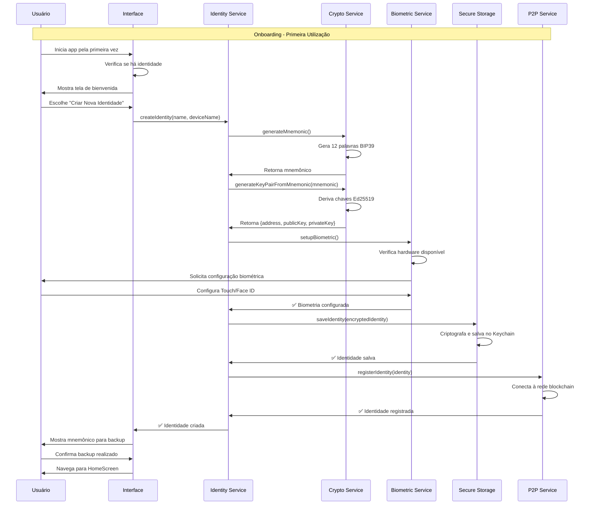
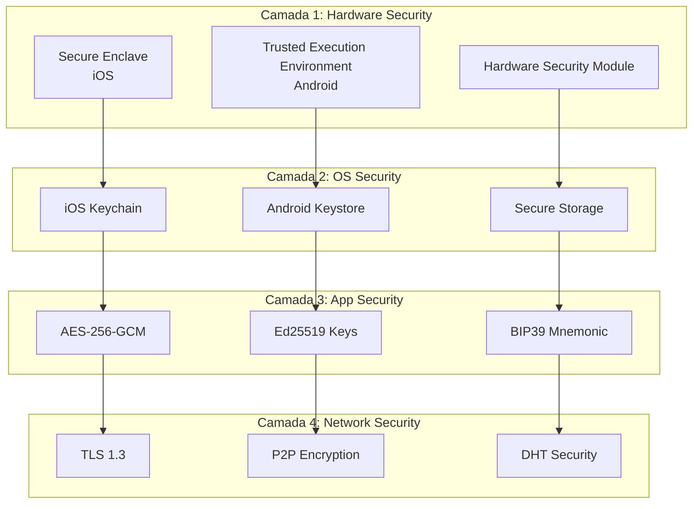

# 📱 VaultZero Mobile - Arquitetura da Aplicação

## 🎯 Visão Geral

O VaultZero Mobile é o centro de controle da identidade digital do usuário, desenvolvido em React Native/Expo. É responsável por gerenciar chaves criptográficas, autenticação biométrica, e servir como gateway seguro para a rede P2P.

## 🏗️ Arquitetura da Aplicação


## 🔄 Fluxo de Criação de Identidade



## 📱 Estrutura de Telas (Screens)

### 1. **Onboarding Flow**
```typescript
interface OnboardingScreens {
  WelcomeScreen: {
    // Apresentação do VaultZero
    // Botões: "Criar Identidade" | "Restaurar"
  }
  
  CreateIdentityScreen: {
    // Formulário: nome, nome do dispositivo
    // Configuração de biometria
  }
  
  BackupScreen: {
    // Exibição das 12 palavras
    // Confirmação de backup
  }
  
  RestoreIdentityScreen: {
    // Input das 12 palavras
    // Restauração da identidade
  }
}
```

### 2. **Main App Flow**
```typescript
interface MainScreens {
  HomeScreen: {
    // Dashboard principal
    // Status da rede P2P
    // Ações rápidas
    permissions: Permission[]
    networkStatus: NetworkStatus
    quickActions: QuickAction[]
  }
  
  QRScannerScreen: {
    // Scanner de QR Code
    // Autorização de websites
    onScan: (qrData: QRCodeData) => void
    onAuthorize: (request: AuthRequest) => Promise<void>
  }
  
  PermissionsScreen: {
    // Lista de sites autorizados
    // Gerenciamento de permissões
    permissions: Permission[]
    onRevoke: (siteUrl: string) => Promise<void>
  }
  
  DevicesScreen: {
    // Dispositivos conectados
    // Adicionar/remover dispositivos
    devices: Device[]
    onAddDevice: () => void
    onRemoveDevice: (deviceId: string) => Promise<void>
  }
  
  SettingsScreen: {
    // Configurações de segurança
    // Backup e recuperação
    // Informações da conta
  }
}
```

## 🔧 Serviços Principais

### 1. **Identity Service** (Singleton)
```typescript
class IdentityService {
  private static instance: IdentityService
  private currentIdentity: BlockchainIdentity | null = null
  
  // Gestão de identidade
  async createIdentity(name: string, deviceName: string): Promise<BlockchainIdentity>
  async restoreIdentity(mnemonic: string, name: string, deviceName: string): Promise<BlockchainIdentity>
  getCurrentIdentity(): BlockchainIdentity | null
  
  // Autorização de websites
  async authorizeWebsite(
    siteUrl: string,
    requestId: string,
    challenge: string,
    selectedFields: string[],
    userData: Record<string, string>
  ): Promise<{success: boolean, error?: string}>
  
  // Gerenciamento de permissões
  getPermissions(): Permission[]
  async revokePermission(siteUrl: string): Promise<boolean>
  
  // Perfil do usuário
  async updateProfile(profileData: any): Promise<void>
  getUserFieldValue(fieldName: string): string | undefined
  
  // Dispositivos
  getDevices(): Device[]
  async addDevice(deviceInfo: DeviceInfo): Promise<boolean>
  async removeDevice(deviceId: string): Promise<boolean>
}
```

### 2. **Crypto Service**
```typescript
class CryptoService {
  // Geração de chaves
  static async generateMnemonic(): Promise<string>
  static async generateKeyPairFromMnemonic(mnemonic: string): Promise<{
    address: string
    publicKey: string
    privateKey: string
  }>
  
  // Criptografia
  static async encrypt(data: string, publicKey: string): Promise<string>
  static async decrypt(encryptedData: string, privateKey: string): Promise<string>
  
  // Assinatura digital
  static async sign(message: string, privateKey: string): Promise<string>
  static async verify(message: string, signature: string, publicKey: string): Promise<boolean>
  
  // Armazenamento seguro
  static async saveIdentity(identity: BlockchainIdentity): Promise<void>
  static async loadIdentity(): Promise<BlockchainIdentity | null>
  static async deleteIdentity(): Promise<void>
  
  // Utilitários
  static generateDeviceId(): string
  static hashData(data: string): string
}
```

### 3. **Biometric Service**
```typescript
class BiometricService {
  private static instance: BiometricService
  
  // Verificação de disponibilidade
  async isBiometricAvailable(): Promise<boolean>
  async getSupportedBiometricTypes(): Promise<BiometricType[]>
  
  // Configuração
  async setupBiometric(): Promise<boolean>
  async isBiometricConfigured(): Promise<boolean>
  
  // Autenticação
  async authenticateWithBiometric(
    reason: string = 'Confirmar sua identidade'
  ): Promise<{success: boolean, error?: string}>
  
  // Gerenciamento
  async disableBiometric(): Promise<void>
  async changeBiometricSettings(): Promise<void>
}
```

### 4. **P2P Service**
```typescript
class P2PService {
  private static instance: P2PService
  private isConnected: boolean = false
  
  // Conexão
  async initialize(): Promise<void>
  async connect(): Promise<void>
  async disconnect(): Promise<void>
  
  // Sincronização
  async syncIdentity(identity: BlockchainIdentity): Promise<void>
  async syncWithPeers(): Promise<void>
  
  // Status da rede
  getNetworkStatus(): NetworkStatus
  getPeers(): PeerInfo[]
  isNetworkHealthy(): boolean
  
  // Comunicação
  async broadcastIdentityUpdate(identity: BlockchainIdentity): Promise<void>
  async requestIdentityVerification(address: string): Promise<boolean>
}
```

## 🔐 Segurança e Armazenamento

### Estratégia de Segurança


### Estrutura de Dados Segura
```typescript
interface SecureIdentityStorage {
  // Dados criptografados no Keychain/Keystore
  encryptedIdentity: {
    address: string                    // Público
    encryptedPrivateKey: string        // AES-256-GCM
    encryptedMnemonic: string          // AES-256-GCM
    encryptedProfile: string           // AES-256-GCM
    deviceId: string                   // Único por instalação
    biometricHash: string              // Template biométrico hash
  }
  
  // Metadados não sensíveis
  metadata: {
    createdAt: string
    lastSync: string
    version: number
    deviceInfo: DeviceInfo
  }
}
```

## 🎨 Componentes de UI

### Design System
```typescript
// Componentes base
interface VaultZeroComponents {
  // Navegação
  CustomTabBar: React.FC<TabBarProps>
  HeaderWithProfile: React.FC<HeaderProps>
  
  // Autenticação
  BiometricPrompt: React.FC<BiometricPromptProps>
  QRCodeScanner: React.FC<QRScannerProps>
  PinInput: React.FC<PinInputProps>
  
  // Identidade
  IdentityCard: React.FC<IdentityCardProps>
  DevicesList: React.FC<DevicesListProps>
  PermissionsList: React.FC<PermissionsListProps>
  
  // Utilidades
  LoadingSpinner: React.FC<LoadingProps>
  StatusIndicator: React.FC<StatusProps>
  SecureButton: React.FC<SecureButtonProps>
}
```

### Temas e Estilização
```typescript
const VaultZeroTheme = {
  colors: {
    primary: '#2563EB',     // Azul principal
    secondary: '#10B981',   // Verde sucesso
    danger: '#EF4444',      // Vermelho erro
    warning: '#F59E0B',     // Amarelo aviso
    surface: '#F8FAFC',     // Fundo claro
    onSurface: '#1E293B',   // Texto principal
  },
  
  spacing: {
    xs: 4, sm: 8, md: 16, lg: 24, xl: 32
  },
  
  typography: {
    heading: 'System',
    body: 'System',
    monospace: 'SF Mono'
  },
  
  biometric: {
    touchId: '👆',
    faceId: '👤',
    fingerprint: '🔒'
  }
}
```

## 📊 Estado da Aplicação

### Gestão de Estado (Context API)
```typescript
interface AppState {
  // Identidade
  identity: {
    current: BlockchainIdentity | null
    isLoading: boolean
    error: string | null
  }
  
  // Rede
  network: {
    status: 'connected' | 'disconnected' | 'connecting'
    peers: PeerInfo[]
    lastSync: Date | null
  }
  
  // Permissões
  permissions: {
    active: Permission[]
    pending: AuthRequest[]
    history: PermissionHistory[]
  }
  
  // UI
  ui: {
    theme: 'light' | 'dark'
    language: 'pt-BR' | 'en-US'
    biometricEnabled: boolean
  }
}
```

## 🧪 Testes e Qualidade

### Estratégia de Testes
```typescript
// Testes unitários
describe('IdentityService', () => {
  test('should create identity with valid mnemonic')
  test('should restore identity from mnemonic')
  test('should authorize website correctly')
  test('should revoke permissions')
})

// Testes de integração
describe('Authentication Flow', () => {
  test('complete onboarding flow')
  test('QR code scanning and authorization')
  test('biometric authentication')
  test('device pairing via QR code')
})

// Testes de segurança
describe('Security Tests', () => {
  test('private keys never leave device')
  test('biometric data is properly encrypted')
  test('mnemonic backup is secure')
  test('P2P communication is encrypted')
})
```

## 🚀 Build e Deploy

### Configuração de Ambiente
```typescript
// app.config.js
export default {
  expo: {
    name: "VaultZero Identity",
    slug: "vaultzero-identity",
    version: "1.0.0",
    platforms: ["ios", "android"],
    
    // Permissões necessárias
    ios: {
      infoPlist: {
        NSCameraUsageDescription: "Para escanear QR Codes de autenticação",
        NSFaceIDUsageDescription: "Para autenticação biométrica segura"
      }
    },
    
    android: {
      permissions: [
        "CAMERA",
        "USE_BIOMETRIC",
        "USE_FINGERPRINT",
        "INTERNET",
        "ACCESS_NETWORK_STATE"
      ]
    }
  }
}
```

## 🔮 Roadmap Mobile

### Fase Atual (v1.0)
- ✅ Criação/restauração de identidade
- ✅ Autenticação biométrica
- ✅ Scanner QR Code
- ✅ Gerenciamento de permissões
- ✅ Sincronização P2P básica

### Próxima Fase (v1.1)
- 🔄 Notificações push
- 🔄 Modo offline avançado
- 🔄 Backup na nuvem (criptografado)
- 🔄 Multi-idiomas

### Futuro (v2.0)
- 📋 Carteira crypto integrada
- 📋 NFTs de identidade
- 📋 Autenticação via NFC
- 📋 Smart contracts

---

> **Nota**: Esta arquitetura prioriza segurança local, experiência do usuário fluida e controle total da identidade digital.
