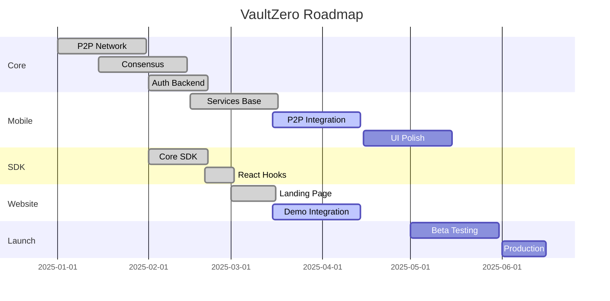

# 🗺️ VaultZero - Roadmap de Desenvolvimento

## Visão Geral

**Período Total**: 18 semanas (4.5 meses)  
**Status Atual**: Sprint 2 em andamento

---

## 📊 Status por Milestone

---

## Sprint 1-2: Mobile Foundation ✅ (Concluído)

| Feature | Status | Arquivo |
|---------|--------|---------|
| Setup React Native + Expo | ✅ | `app.json` |
| Geração mnemônico BIP39 | ✅ | `services/crypto.ts` |
| Armazenamento seguro | ✅ | Expo SecureStore |
| Serviço P2P base | ✅ | `services/p2p.ts` |
| Identity service | ✅ | `services/identity.ts` |
| Biometric service | ✅ | `services/biometric.ts` |

---

## Sprint 3-4: P2P Integration 🔄 (Em Andamento)

| Feature | Status | Prioridade |
|---------|--------|------------|
| Conexão mobile ↔ core | 🔄 80% | Alta |
| QR Code scanning real | ⏳ | Alta |
| Pareamento de dispositivos | ⏳ | Alta |
| Sincronização DHT | 🔄 60% | Média |
| Testes end-to-end | ⏳ | Média |

**Deliverables**:
- [ ] Fluxo completo: Mobile → QR → Core → Website
- [ ] Sync de identidade entre dispositivos
- [ ] Demo funcionando end-to-end

---

## Sprint 5-6: Website Integration

| Feature | Prioridade | Estimativa |
|---------|------------|------------|
| Fluxo auth completo | Alta | 3 dias |
| Dashboard funcional | Média | 2 dias |
| Gerenciamento de sessão | Alta | 2 dias |
| SSE real-time | Alta | 1 dia |
| UI Polish | Média | 3 dias |

---

## Sprint 7-8: Carteira Digital

| Feature | Prioridade | Estimativa |
|---------|------------|------------|
| Armazenamento de cartões | Alta | 3 dias |
| Integração NFC (iOS) | Alta | 4 dias |
| Integração NFC (Android) | Alta | 4 dias |
| UI de pagamento | Média | 2 dias |
| Testes de segurança | Alta | 3 dias |

---

## Sprint 9-10: Multiple Identities

| Feature | Prioridade | Estimativa |
|---------|------------|------------|
| Criar múltiplas identidades | Alta | 2 dias |
| Switcher de identidades | Alta | 2 dias |
| Contextos separados | Média | 2 dias |
| Sync por identidade | Alta | 3 dias |
| UI de gerenciamento | Média | 2 dias |

---

## Sprint 11-12: Browser Extension

| Feature | Prioridade | Estimativa |
|---------|------------|------------|
| Manifest WebExtension | Alta | 1 dia |
| Content script injection | Alta | 3 dias |
| Background P2P connection | Alta | 4 dias |
| Auto-fill de formulários | Média | 3 dias |
| Build Chrome/Firefox/Safari | Alta | 2 dias |

---

## Sprint 13-14: Desktop App

| Feature | Prioridade | Estimativa |
|---------|------------|------------|
| Setup Electron | Alta | 1 dia |
| Windows Hello integration | Alta | 3 dias |
| macOS Touch ID | Alta | 2 dias |
| System tray | Média | 2 dias |
| Bootstrap node mode | Baixa | 3 dias |

---

## Sprint 15-16: Production Ready

| Feature | Prioridade | Estimativa |
|---------|------------|------------|
| Security audit | Crítica | 5 dias |
| Performance optimization | Alta | 3 dias |
| Error handling | Alta | 2 dias |
| Monitoring (Prometheus) | Média | 2 dias |
| Logging (ELK) | Média | 2 dias |

---

## Sprint 17-18: Beta Launch

| Feature | Prioridade | Estimativa |
|---------|------------|------------|
| Bootstrap nodes globais | Alta | 3 dias |
| Deploy staging | Alta | 2 dias |
| Beta testing (100 users) | Alta | 10 dias |
| Bug fixes | Alta | 5 dias |
| Production deploy | Alta | 2 dias |

---

## Métricas de Sucesso

| Milestone | KPI | Target |
|-----------|-----|--------|
| MVP | Login funcional | 100% fluxo |
| Beta | Usuários ativos | 100 |
| v1.0 | Sites integrados | 5 |
| v1.5 | Usuários pagantes | 1000 |
| v2.0 | ARR | $100K |

---

## Riscos e Mitigações

| Risco | Probabilidade | Impacto | Mitigação |
|-------|--------------|---------|-----------|
| NAT traversal complexo | Alta | Alto | STUN/TURN servers |
| App Store rejections | Média | Alto | Seguir guidelines |
| Performance mobile | Média | Médio | Otimização contínua |
| Adoção lenta | Alta | Alto | Foco em nicho crypto |

---

## Próximos Passos Imediatos

1. ⏳ **Hoje**: Finalizar conexão mobile ↔ core
2. ⏳ **Esta semana**: QR scanning funcional
3. ⏳ **Próxima semana**: Demo end-to-end
4. ⏳ **Em 2 semanas**: Beta privado com 10 users
