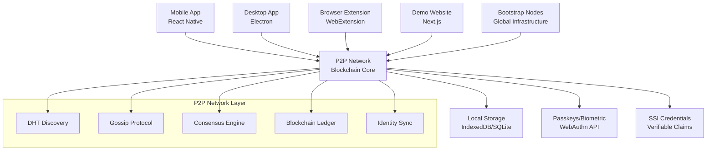

# VaultZero - Especificação Técnica de Implementação

## Visão Geral

VaultZero é um sistema de autenticação sem senhas baseado em blockchain P2P descentralizada que implementa Self-Sovereign Identity (SSI). O sistema permite que usuários controlem totalmente suas identidades digitais usando endereços blockchain únicos e seeds de 12 palavras para recuperação, sem depender de autoridades centralizadas.

## Modelo de Identidade Blockchain

### **🔑 Identidade Base (BIP39/HD Wallet)**
```typescript
interface BlockchainIdentity {
  // Identificação única
  address: string;           // "0x742d35Cc..." (chave pública derivada)
  mnemonic?: string;         // 12 palavras BIP39 (apenas local, criptografado)
  derivationPath: string;    // "m/44'/60'/0'/0/0" (padrão Ethereum)
  publicKey: string;         // Para verificação de assinaturas
  
  // Metadados do dispositivo
  devices: {
    [deviceId: string]: {
      name: string;           // "iPhone-João", "PC-Casa"
      addedAt: Date;
      lastSync: Date;
      publicKey: string;
    }
  };
  
  // Dados SSI (Self-Sovereign Identity)
  profile: {
    name?: string;
    email?: string;
    phone?: string;
    document?: string;        // CPF/Passport (criptografado)
    address?: string;         // Endereço físico (criptografado)
  };
  
  // Permissões por site
  permissions: {
    [siteUrl: string]: {
      allowedFields: string[];
      grantedAt: Date;
      expiresAt?: Date;
      autoLogin: boolean;
    }
  };
}
```

### **🔄 Fluxos de Adição de Dispositivo**

#### **1. QR Code Flow (Dispositivo Confiável Presente)**
```typescript
interface QRPairingFlow {
  // 1. Novo dispositivo gera solicitação
  generatePairingRequest(): {
    deviceId: string;
    deviceName: string;
    tempPublicKey: string;
    timestamp: number;
    challenge: string;
  };
  
  // 2. QR Code + código 6 dígitos
  createQRData(request: PairingRequest): {
    type: "device_pairing";
    challenge: string;
    pairingCode: string;      // 6 dígitos adicionais
    publicKey: string;
    expiresAt: number;        // 5 minutos
  };
  
  // 3. Transferência segura da seed
  transferIdentity(
    encryptedSeed: string,
    deviceInfo: DeviceInfo,
    biometricSignature: string
  ): Promise<boolean>;
}
```

#### **2. Seed Recovery Flow (Sem Dispositivo Confiável)**
```typescript
interface SeedRecoveryFlow {
  // 1. Validação das 12 palavras
  validateMnemonic(words: string[]): boolean;
  
  // 2. Derivação da identidade
  recoverIdentity(mnemonic: string): {
    address: string;
    privateKey: string;
    publicKey: string;
  };
  
  // 3. Configuração biométrica local
  setupLocalBiometric(
    encryptedSeed: string,
    biometricTemplate: BiometricData
  ): Promise<void>;
}

## Arquitetura do Sistema

### Componentes Principais



### Stack Tecnológico

#### Backend Core (Já Implementado)
- **Runtime**: Node.js + TypeScript
- **P2P Network**: libp2p
- **Blockchain**: Custom implementation
- **Consensus**: Practical Byzantine Fault Tolerance (pBFT)
- **Storage**: LevelDB + IndexedDB
- **Crypto**: WebCrypto API + noble-crypto

#### Frontend Applications (A Implementar)
- **Mobile**: React Native + Expo
- **Desktop**: Electron + React
- **Browser Extension**: WebExtension API + React
- **Demo Site**: Next.js + React

#### Infraestrutura
- **Bootstrap Nodes**: Docker + Kubernetes
- **NAT Traversal**: STUN/TURN servers
- **CDN**: Para assets estáticos

## Estrutura do Projeto

```
passless-id/
├── src/                          # Backend core (implementado)
│   ├── blockchain/
│   ├── network/
│   ├── auth/
│   └── storage/
├── mobile/                       # React Native app
│   ├── src/
│   ├── ios/
│   ├── android/
│   └── app.json
├── desktop/                      # Electron app
│   ├── src/
│   ├── main/
│   └── renderer/
├── extension/                    # Browser extensions
│   ├── src/
│   ├── manifest.json
│   └── builds/
├── website/                      # Demo website
│   ├── src/
│   ├── pages/
│   └── components/
├── bootstrap/                    # Bootstrap nodes
│   ├── docker/
│   ├── k8s/
│   └── terraform/
├── docs/                         # Documentação
└── tests/                        # Testes integrados
```

## Implementação por Fases

### Fase 1: App Mobile React Native ⏳

#### Objetivos
- Interface móvel nativa para gerenciar identidades
- Integração com biometria/passkeys
- Sincronização P2P completa

#### Stack Técnico
```json
{
  "framework": "React Native 0.73+",
  "navigation": "@react-navigation/native",
  "state": "@reduxjs/toolkit",
  "crypto": "react-native-crypto",
  "biometric": "react-native-biometrics",
  "storage": "@react-native-async-storage/async-storage",
  "p2p": "react-native-libp2p"
}
```

#### Estrutura do App
```
mobile/
├── src/
│   ├── screens/
│   │   ├── onboarding/
│   │   ├── identity/
│   │   ├── credentials/
│   │   └── settings/
│   ├── components/
│   │   ├── auth/
│   │   ├── p2p/
│   │   └── ui/
│   ├── services/
│   │   ├── p2p-client.ts
│   │   ├── identity-manager.ts
│   │   └── credential-store.ts
│   ├── store/
│   └── utils/
└── assets/
```

#### Funcionalidades Core
1. **Onboarding**
   - Criação de identidade descentralizada
   - Configuração de biometria
   - Backup de chaves privadas

2. **Gerenciamento de Identidade**
   - Visualização de DIDs
   - Edição de perfil
   - Histórico de transações

3. **Credenciais Verificáveis**
   - Emissão de credenciais
   - Verificação de provas
   - Compartilhamento seletivo

4. **Rede P2P**
   - Status de conexão
   - Descoberta de peers
   - Sincronização de dados

#### APIs Necessárias
```typescript
// P2P Client para React Native
interface P2PClient {
  connect(): Promise<void>;
  disconnect(): Promise<void>;
  createIdentity(biometric: BiometricData): Promise<DID>;
  shareCredential(did: string, credential: VerifiableCredential): Promise<void>;
  verifyCredential(proof: VerifiablePresentation): Promise<boolean>;
  syncWithNetwork(): Promise<void>;
}

// Biometric Integration
interface BiometricAuth {
  isAvailable(): Promise<boolean>;
  authenticate(): Promise<BiometricResult>;
  enrollFingerprint(): Promise<void>;
  enrollFaceID(): Promise<void>;
}
```

### Fase 2: Aplicação Desktop Electron ⏳

#### Objetivos
- Interface desktop completa
- Integração com OS (Windows Hello, Touch ID)
- Funcionalidade de bootstrap node

#### Stack Técnico
```json
{
  "framework": "Electron 28+",
  "frontend": "React + TypeScript",
  "state": "Zustand",
  "styling": "Tailwind CSS",
  "crypto": "node-crypto",
  "os-auth": "electron-auth"
}
```

#### Funcionalidades Específicas
1. **System Tray Integration**
   - Status de conexão P2P
   - Notificações de autenticação
   - Acesso rápido a credenciais

2. **OS Authentication**
   - Windows Hello
   - macOS Touch ID/Face ID
   - Linux PAM integration

3. **Bootstrap Node Mode**
   - Executar como nó de bootstrap
   - Relay para outros peers
   - Estatísticas de rede

### Fase 3: Extensões de Navegador ⏳

#### Objetivos
- Autenticação automática em sites
- Injeção de credenciais
- Proteção contra phishing

#### Estrutura da Extensão
```
extension/
├── manifest.json
├── src/
│   ├── background/
│   │   ├── service-worker.ts
│   │   └── p2p-background.ts
│   ├── content/
│   │   ├── auth-injector.ts
│   │   └── form-detector.ts
│   ├── popup/
│   │   ├── popup.tsx
│   │   └── components/
│   └── options/
│       └── settings.tsx
└── builds/
    ├── chrome/
    ├── firefox/
    └── safari/
```

#### APIs WebExtension
```typescript
// Content Script API
interface AuthInjector {
  detectLoginForms(): Promise<HTMLFormElement[]>;
  injectPasslessAuth(form: HTMLFormElement): Promise<void>;
  handleAuthResponse(response: AuthResponse): Promise<void>;
}

// Background Script API
interface BackgroundP2P {
  initializeP2PConnection(): Promise<void>;
  handleAuthRequest(request: AuthRequest): Promise<AuthResponse>;
  syncCredentials(): Promise<void>;
}
```

### Fase 4: Site de Demonstração ⏳

#### Objetivos
- Demonstrar integração VaultZero
- Casos de uso reais
- Documentação interativa

#### Stack Next.js
```json
{
  "framework": "Next.js 14",
  "styling": "Tailwind CSS",
  "ui": "Shadcn/ui",
  "auth": "VaultZero SDK",
  "deployment": "Vercel"
}
```

#### Páginas e Funcionalidades
1. **Landing Page**
   - Demonstração interativa
   - Comparação com métodos tradicionais
   - Call-to-action para testar

2. **Demo App**
   - Login/registro sem senha
   - Compartilhamento de credenciais
   - Verificação de identidade

3. **Developer Portal**
   - SDK documentation
   - Integration guides
   - API reference

### Fase 5: Bootstrap Nodes Globais ⏳

#### Objetivos
- Infraestrutura global de descoberta
- Alta disponibilidade
- Balanceamento de carga

#### Infraestrutura
```yaml
# Kubernetes Deployment
apiVersion: apps/v1
kind: Deployment
metadata:
  name: passless-bootstrap
spec:
  replicas: 3
  selector:
    matchLabels:
      app: passless-bootstrap
  template:
    spec:
      containers:
      - name: bootstrap-node
        image: passless/bootstrap:latest
        ports:
        - containerPort: 4001
        env:
        - name: NODE_ENV
          value: production
        - name: BOOTSTRAP_MODE
          value: "true"
```

#### Regiões de Deploy
- **América do Norte**: AWS us-east-1, us-west-2
- **Europa**: AWS eu-west-1, eu-central-1
- **Ásia**: AWS ap-southeast-1, ap-northeast-1
- **América do Sul**: AWS sa-east-1

## Protocolos de Comunicação

### 1. Identity Creation Protocol

```typescript
interface IdentityCreationFlow {
  // 1. Gerar par de chaves
  generateKeyPair(): Promise<CryptoKeyPair>;
  
  // 2. Criar DID
  createDID(publicKey: CryptoKey): Promise<DID>;
  
  // 3. Registrar na blockchain
  registerOnBlockchain(did: DID, signature: string): Promise<TransactionHash>;
  
  // 4. Propagar via gossip
  broadcastIdentity(identity: Identity): Promise<void>;
}
```

### 2. Authentication Protocol

```typescript
interface AuthenticationFlow {
  // 1. Solicitação de autenticação
  requestAuth(challenge: string, domain: string): Promise<AuthChallenge>;
  
  // 2. Prova biométrica
  generateBiometricProof(challenge: AuthChallenge): Promise<BiometricProof>;
  
  // 3. Assinatura digital
  signChallenge(proof: BiometricProof, privateKey: CryptoKey): Promise<Signature>;
  
  // 4. Verificação distribuída
  verifyAuthProof(signature: Signature, did: DID): Promise<VerificationResult>;
}
```

### 3. Credential Sharing Protocol

```typescript
interface CredentialSharingFlow {
  // 1. Solicitação de credencial
  requestCredential(type: string, requester: DID): Promise<CredentialRequest>;
  
  // 2. Consentimento do usuário
  getUserConsent(request: CredentialRequest): Promise<ConsentDecision>;
  
  // 3. Criação de apresentação verificável
  createPresentation(
    credentials: VerifiableCredential[],
    consent: ConsentDecision
  ): Promise<VerifiablePresentation>;
  
  // 4. Transmissão segura
  transmitPresentation(
    presentation: VerifiablePresentation,
    recipient: DID
  ): Promise<void>;
}
```

## Implementação de Segurança

### 1. Criptografia
- **Assinatura Digital**: Ed25519
- **Criptografia Simétrica**: AES-256-GCM
- **Hash**: SHA-256
- **Derivação de Chaves**: PBKDF2

### 2. Biometria
- **Armazenamento**: Secure Enclave/TEE
- **Templates**: Nunca deixam o dispositivo
- **Matching**: Local only

### 3. P2P Security
- **Transport**: TLS 1.3
- **Identity**: DIDs com chaves públicas
- **Anti-Sybil**: Proof of Work light

## Testes e Qualidade

### 1. Testes Unitários
```bash
# Backend
npm run test:unit

# Mobile
cd mobile && npm run test

# Desktop
cd desktop && npm run test

# Extension
cd extension && npm run test
```

### 2. Testes de Integração
```bash
# P2P Network
./test_p2p_auto.sh

# End-to-end
npm run test:e2e

# Performance
npm run test:perf
```

### 3. Testes de Segurança
```bash
# Penetration testing
npm run test:security

# Vulnerability scan
npm audit

# Dependency check
npm run check:deps
```

## Métricas e Monitoramento

### 1. Métricas de Rede
- Número de peers conectados
- Latência de sincronização
- Taxa de sucesso de descoberta
- Throughput de mensagens

### 2. Métricas de Usuário
- Tempo de autenticação
- Taxa de sucesso biométrico
- Uso de credenciais
- Satisfação do usuário

### 3. Métricas de Segurança
- Tentativas de ataque
- Falsos positivos/negativos
- Tempo de resposta a incidentes

## Roadmap de Desenvolvimento

### Sprint 1-2: Mobile App Foundation (2 semanas)
- [ ] Setup do projeto React Native
- [ ] Integração com backend P2P
- [ ] Telas básicas de onboarding
- [ ] Configuração de biometria

### Sprint 3-4: Mobile App Core Features (2 semanas)
- [ ] Criação de identidades
- [ ] Sincronização P2P
- [ ] Gerenciamento de credenciais
- [ ] Interface de autenticação

### Sprint 5-6: Desktop Application (2 semanas)
- [ ] Setup Electron + React
- [ ] Integração OS authentication
- [ ] System tray integration
- [ ] Bootstrap node mode

### Sprint 7-8: Browser Extensions (2 semanas)
- [ ] Manifest e estrutura base
- [ ] Content script injection
- [ ] Background P2P connection
- [ ] Form detection e auto-fill

### Sprint 9-10: Demo Website (2 semanas)
- [ ] Next.js setup
- [ ] VaultZero integration
- [ ] Demo scenarios
- [ ] Documentation portal

### Sprint 11-12: Infrastructure & Polish (2 semanas)
- [ ] Bootstrap nodes deployment
- [ ] Performance optimization
- [ ] Security audit
- [ ] Production deployment

## Considerações de Deploy

### 1. Mobile App Distribution
- **iOS**: App Store Connect
- **Android**: Google Play Store
- **Beta**: TestFlight + Firebase App Distribution

### 2. Desktop App Distribution
- **Windows**: Microsoft Store + Direct download
- **macOS**: Mac App Store + Notarization
- **Linux**: Snap Store + AppImage

### 3. Browser Extensions
- **Chrome**: Chrome Web Store
- **Firefox**: Mozilla Add-ons
- **Safari**: Safari Extensions Gallery
- **Edge**: Microsoft Edge Add-ons

### 4. Infrastructure
- **Bootstrap Nodes**: Kubernetes multi-region
- **CDN**: CloudFlare
- **Monitoring**: Prometheus + Grafana
- **Logging**: ELK Stack

## Conclusão

Esta especificação técnica fornece o roadmap completo para implementar todos os componentes do sistema VaultZero. Cada fase pode ser desenvolvida independentemente, mas todas se integram ao backend P2P já funcional.

O próximo passo é começar com o desenvolvimento do app mobile React Native, seguindo a estrutura e APIs definidas neste documento.
